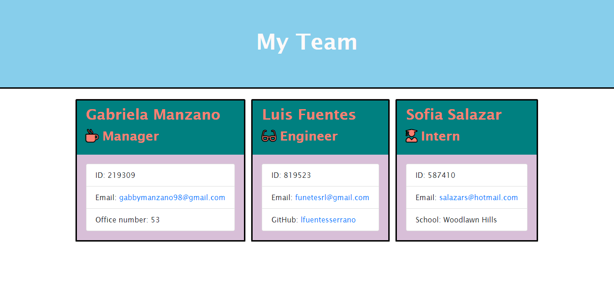

# HW-10-Template-Engine

## Description
 This application is intended for a business Manager to create a team for the company based on a series of questions, which are promted by running a test on a new terminal.

 ## Table of Contents 

 * Description
 * Installation
 * Usage
 * Test 
 * Question

 ## Installation
First you have to run a terminal in VS CODE, Install the correct dependicies.
Type npm i, then after that has finished you can run the application by typing 
node app.js, which should prompt you to the questions need it to create your team.

## Usage
Answer all the questions giving to you after the installation part is completed, once you have answered all the questions the team.html file will be created as well as the 
output folder.

## Application Run Through

